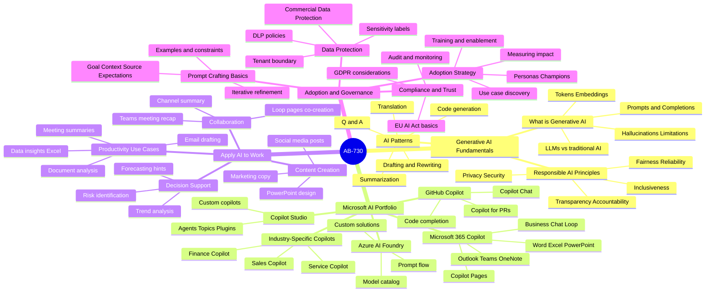
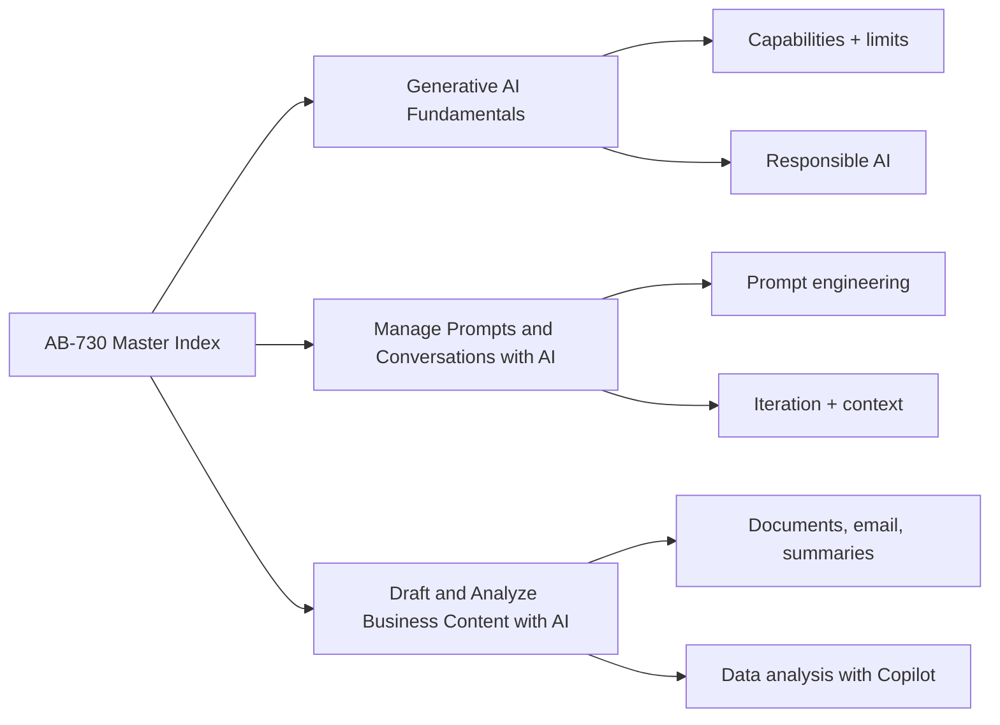
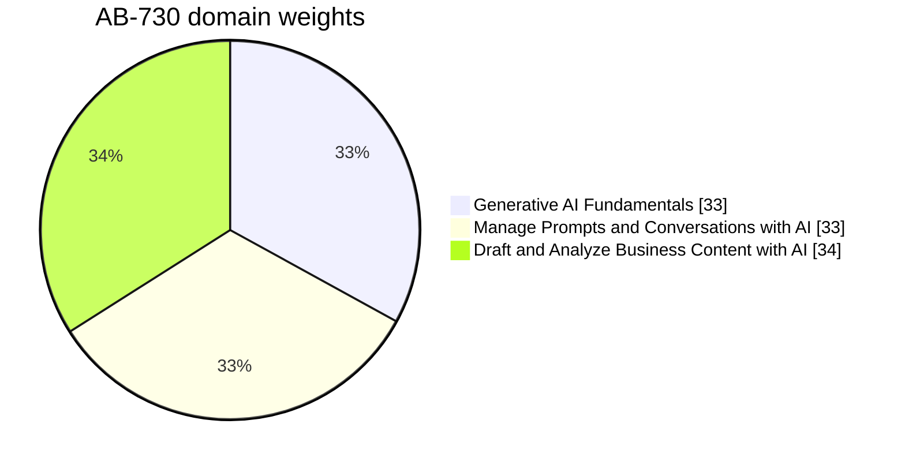

# AB-730 - Microsoft Certified: AI Business Professional - Visual Study Guide

> Concept-only study aid. No exam questions reproduced. Source PDF (if any) stays local + gitignored.

**Skills outline:** https://learn.microsoft.com/en-us/credentials/certifications/ai-business-professional/

## The 4 Exam Domains - Mind Map

## Domain map

## Domain weights

## Recommended study order

```mermaid
gantt
    title Suggested study plan
    dateFormat X
    axisFormat Day %d
    section Plan
    Generative AI Fundamentals :t1, 0, 1d
    Manage Prompts and Conversations with AI :t2, after t1, 2d
    Draft and Analyze Business Content with AI :t3, after t2, 2d
```

## What this exam tests

AB-730 is for **business users**, not developers or admins. It validates that you can:
- Use Microsoft 365 Copilot, Copilot Chat, and other GenAI tools effectively to do real business work.
- Understand the **basics** of how generative AI works (LLMs, hallucinations, grounding) without coding knowledge.
- Apply **responsible AI principles** when using AI tools at work.
- Craft **effective prompts** to get useful business outputs.
- Use AI to **draft, analyze, and summarize** business content (emails, docs, meetings, data).

## Top 12 things to know

1. **Generative AI** creates new content from a prompt; trained on massive datasets.
2. **LLMs hallucinate** - they invent plausible-but-wrong facts. Always verify.
3. **Copilot in Microsoft 365** is grounded in your tenant data via the Microsoft Graph - more accurate than web Copilot for work tasks.
4. **Microsoft Copilot (free, web)** uses public web data + GPT models. No tenant grounding.
5. **Responsible AI** = fairness, reliability, privacy, inclusiveness, transparency, accountability.
6. **Effective prompts** include: goal, context, source/data, format, tone, length.
7. **Iterate** prompts: rarely is the first answer perfect. Refine.
8. **Citations** in Copilot's grounded answers link to the underlying file - click to verify.
9. **Sensitivity labels** (from Microsoft Purview) flow through Copilot output.
10. **You are responsible** for what you publish from AI output.
11. **Don't paste regulated data** (PHI, PCI) into web Copilot.
12. **Copilot Chat (web grounding)** can use Bing search; M365 Copilot uses your work data.

## Common gotchas

- Web Copilot does NOT see your work files; M365 Copilot does.
- Copilot summaries can omit important nuance.
- AI-generated images may be biased without prompt guardrails.
- Copilot in Excel needs a structured table.
- Copilot in Outlook drafts emails in your voice based on past sent items - review tone.

## Supporting pages

- [05-exam-cheatsheet.md](05-exam-cheatsheet.md)
- [06-references.md](06-references.md)
- [07-extra-ab730-concepts.md](07-extra-ab730-concepts.md)
- [08-learn-summaries.md](08-learn-summaries.md)
- [09-arch-ab730.md](09-arch-ab730.md)
- [11-microsoft-resources.md](11-microsoft-resources.md)
- [12-glossary.md](12-glossary.md)
- [13-flashcards.md](13-flashcards.md)
- [14-pitfalls.md](14-pitfalls.md)
- [15-hands-on-labs.md](15-hands-on-labs.md)
- [16-architecture-center.md](16-architecture-center.md)
- [17-copilot-quiz.md](17-copilot-quiz.md)
- [99-practice-assessment.md](99-practice-assessment.md)
- [99-video-tutorials.md](99-video-tutorials.md)

---

**Next:** open [01-genai-fundamentals.md](01-genai-fundamentals.md)
