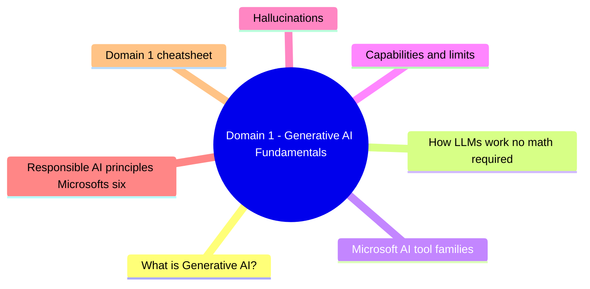
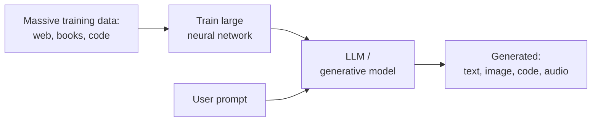
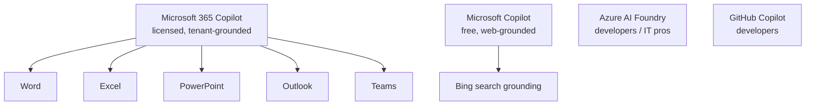
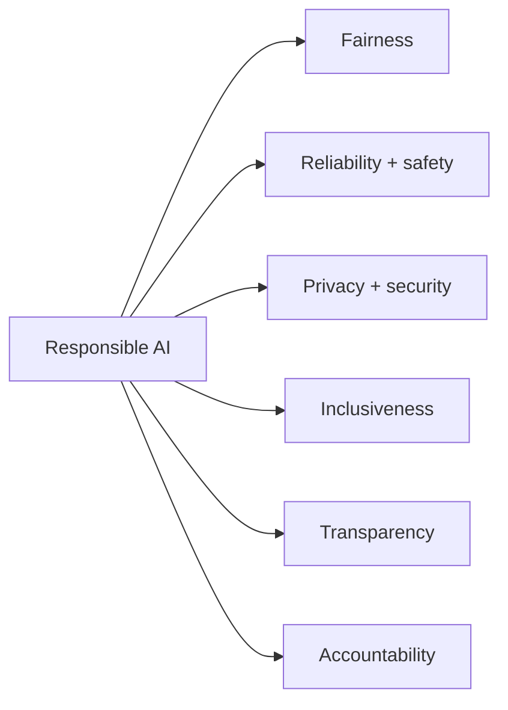

# Domain 1: Generative AI Fundamentals

> What generative AI is, how it works at a conceptual level, and what its limits are.

## Domain mind map

## What is Generative AI?

Generative AI **creates new content** from a prompt. Three common output types:

| Modality | Example tools | Output |
|---|---|---|
| Text | ChatGPT, Microsoft Copilot, Gemini | Articles, emails, summaries |
| Image | DALL-E, Designer, Midjourney | Photos, illustrations, mockups |
| Code | GitHub Copilot | Code snippets and entire files |

## How LLMs work (no math required)

1. **Tokenize** input - break text into tokens (~ words / sub-words).
2. **Predict next token** - based on training, what's the most likely next token?
3. **Generate** - repeat until the model emits a stop token.
4. **Decode** - tokens back to readable text.

The model has no real-world knowledge after its **training cutoff**. To get current information it needs **grounding** (retrieval) such as web search or your tenant data.

## Microsoft AI tool families

| Tool | Audience | Grounding | License |
|---|---|---|---|
| Microsoft Copilot (web) | Anyone | Public web | Free + Pro |
| Microsoft 365 Copilot | M365 users | Microsoft Graph | Per-user license |
| Copilot Studio | Makers | Custom topics + connectors | Standalone or M365 |
| Azure AI Foundry | Developers | Your custom data | PAYG |
| GitHub Copilot | Developers | Code context | Per-user |

## Capabilities and limits

| Can | Cannot |
|---|---|
| Summarize, draft, translate | Replace human judgment for legal / medical / financial advice |
| Answer general knowledge | Know events after its training cutoff (without grounding) |
| Generate creative content | Verify factual accuracy reliably |
| Pattern-match across domains | Cite sources unprompted (must be grounded) |
| Transform tone / format | Reason perfectly with numbers (math errors common) |

## Hallucinations

A **hallucination** is when the model generates plausible-sounding but **incorrect** information.

**Mitigation:**
1. Use grounded tools (M365 Copilot, Copilot with web access).
2. Ask Copilot for citations - then click them.
3. Cross-check with a primary source for any decision-driving claim.

## Responsible AI principles (Microsoft's six)

- **Fairness:** AI does not unfairly disadvantage groups.
- **Reliability and safety:** AI works as intended, fails gracefully.
- **Privacy and security:** Data is protected; minimal collection.
- **Inclusiveness:** AI works for everyone (accessibility, languages).
- **Transparency:** Users know they are using AI, can see how decisions are made.
- **Accountability:** Humans remain responsible for AI decisions.

## Domain 1 cheatsheet

| Question wording | Answer |
|---|---|
| "model invents fake facts" | Hallucination |
| "AI tool that uses my work emails as context" | Microsoft 365 Copilot |
| "free AI tool grounded in web search" | Microsoft Copilot (web) |
| "principle that AI must work for everyone with accessibility" | Inclusiveness |
| "principle that AI tells users they are using AI" | Transparency |

---

**Next:** open [02-prompts-conversations.md](02-prompts-conversations.md)
