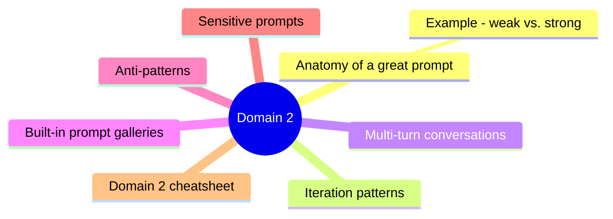
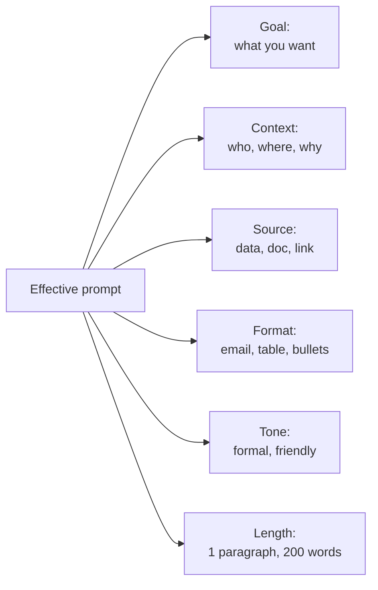
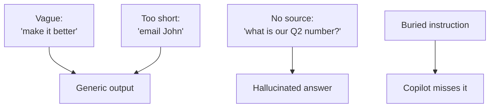

# Domain 2: Manage Prompts and Conversations with AI

> How to talk to Copilot effectively for business work.

## Domain mind map

## Anatomy of a great prompt

**Microsoft's GCSE pattern:**
- **G**oal - what should the output do?
- **C**ontext - what's the situation?
- **S**ource - what files / links / numbers should ground the answer?
- **E**xpectations - format, tone, length, audience.

### Example: weak vs. strong

| Weak | Strong |
|---|---|
| "Write an email about the project." | "Draft a 100-word email to my product team announcing that the Q2 launch is delayed by 2 weeks. Tone: confident and reassuring. Reference the attached project plan. End with a call for feedback by Friday." |

## Iteration patterns

| Refinement verb | Effect |
|---|---|
| "Make it shorter / longer" | Length |
| "More formal / more casual" | Tone |
| "Add bullet points" | Format |
| "Focus on the customer's perspective" | Framing |
| "Cite the source for each claim" | Verifiability |
| "Translate to Spanish" | Language |

## Multi-turn conversations

- Copilot **remembers context within a chat**.
- Long chats can drift - **start a new chat** for unrelated topics or major direction changes.
- Microsoft Copilot Pro / M365 Copilot remember across longer windows than free.

## Built-in prompt galleries

| Surface | Built-in prompts |
|---|---|
| Word | Summarize doc, draft from outline, rewrite for tone |
| Excel | Analyze table, suggest formula, create chart |
| PowerPoint | Create from doc, add speaker notes, redesign slide |
| Outlook | Draft reply, summarize thread, schedule meeting |
| Teams | Summarize meeting, find decisions, list action items |

## Anti-patterns

| Anti-pattern | Fix |
|---|---|
| Vague verbs ("make it better") | Specify axis: faster, shorter, friendlier |
| No context | Add audience, goal, format |
| No source for factual question | Paste data or attach file |
| Multiple goals in one prompt | Split into separate prompts |
| No examples for tricky output | Show one good and one bad example |

## Sensitive prompts

- Microsoft Copilot has **content filters** for unsafe / harmful prompts.
- M365 Copilot **respects sensitivity labels** - confidential files stay confidential.
- **DO NOT paste** regulated data (PHI, PCI, classified) into web Copilot.

## Domain 2 cheatsheet

| Wording | Answer |
|---|---|
| "AI gave generic output" | Prompt was too vague - apply GCSE |
| "AI made up a stat about our company" | Prompt lacked grounding - attach source |
| "I want a table from this paragraph" | Add format spec to prompt |
| "Tone is wrong" | Iterate: "rewrite in a more confident tone" |

---

**Next:** open [03-draft-analyze-content.md](03-draft-analyze-content.md)
