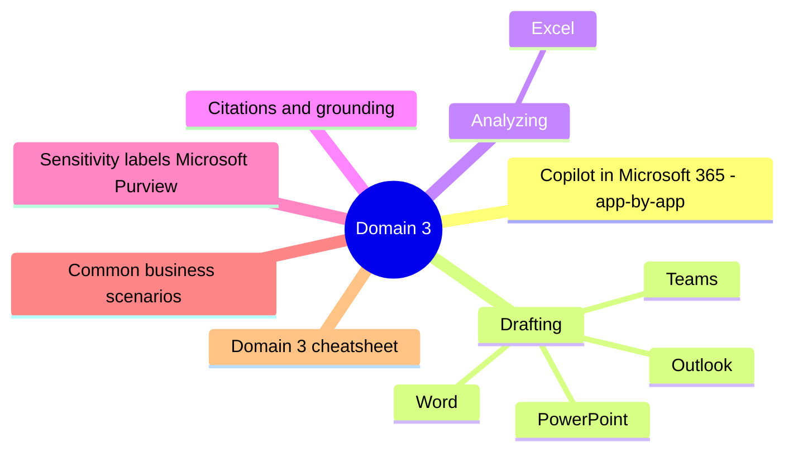
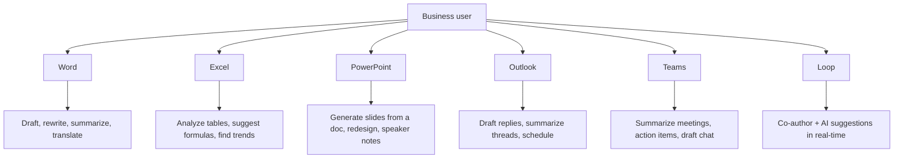
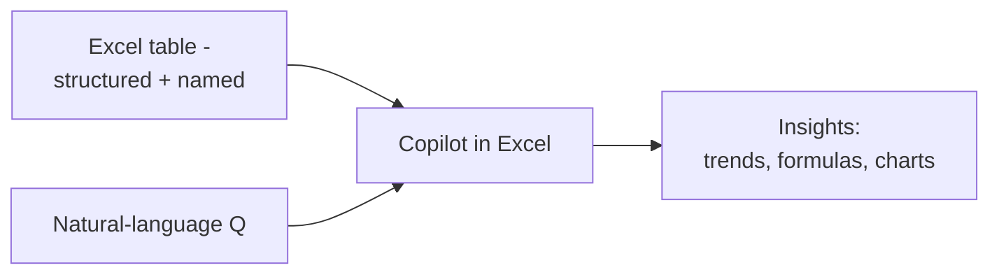
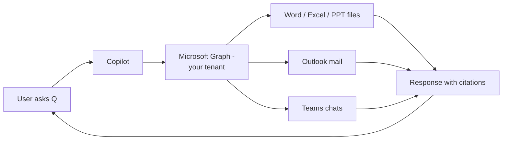

# Domain 3: Draft and Analyze Business Content with AI

> Practical use of Copilot across the M365 suite for drafting, summarizing, and analyzing.

## Domain mind map

## Copilot in Microsoft 365 - app-by-app

## Drafting

### Word
- "Generate a 2-page proposal for X based on the attached brief."
- "Rewrite this paragraph more concisely."
- "Translate this section to Japanese."

### Outlook
- "Draft a reply that asks for the budget by Friday and confirms the meeting."
- "Summarize this 30-message thread - what was decided?"

### PowerPoint
- "Create a 10-slide deck from the attached Word doc."
- "Add speaker notes that explain each chart."

### Teams
- "Summarize the last hour of this channel."
- "What action items came out of yesterday's meeting?"

## Analyzing

### Excel

- Data must be **structured as a table** (Format As Table or Insert > Table).
- Ask: "What's the top selling region in Q2?"
- Ask: "Suggest a formula to flag rows where margin is below 10%."
- Ask: "Create a chart showing month-over-month growth."

**Limit:** Copilot in Excel does not run Python or arbitrary scripts.

## Citations and grounding

Microsoft 365 Copilot **cites the source** of each fact when grounded in your tenant.

## Sensitivity labels (Microsoft Purview)

- Files labeled Confidential / Highly Confidential keep their label when Copilot summarizes them.
- Output **inherits** the highest sensitivity label of any cited source.

## Common business scenarios

| Need | Best Copilot tool |
|---|---|
| Draft proposal from RFP | Word |
| Summarize 50-message email thread | Outlook |
| Generate exec deck from 30-page doc | PowerPoint |
| Find trends in a sales spreadsheet | Excel |
| Catch up on a 1h missed meeting | Teams |
| Draft customer apology email | Outlook |
| Translate doc to French | Word |
| Brainstorm campaign tagline | Microsoft Copilot (web) |
| Search public news on competitor | Microsoft Copilot (web) |

## Domain 3 cheatsheet

| Wording | Answer |
|---|---|
| "summarize a long email thread" | Copilot in Outlook |
| "generate slides from a Word doc" | Copilot in PowerPoint |
| "catch up on a meeting I missed" | Copilot in Teams |
| "find the top product by margin" | Copilot in Excel (table required) |
| "translate a section of a contract" | Copilot in Word |
| "search the web for industry news" | Microsoft Copilot (web, free) |

---

**Next:** open [05-exam-cheatsheet.md](05-exam-cheatsheet.md)
