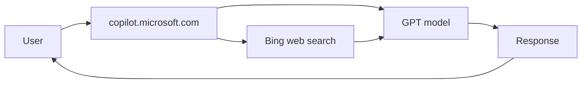
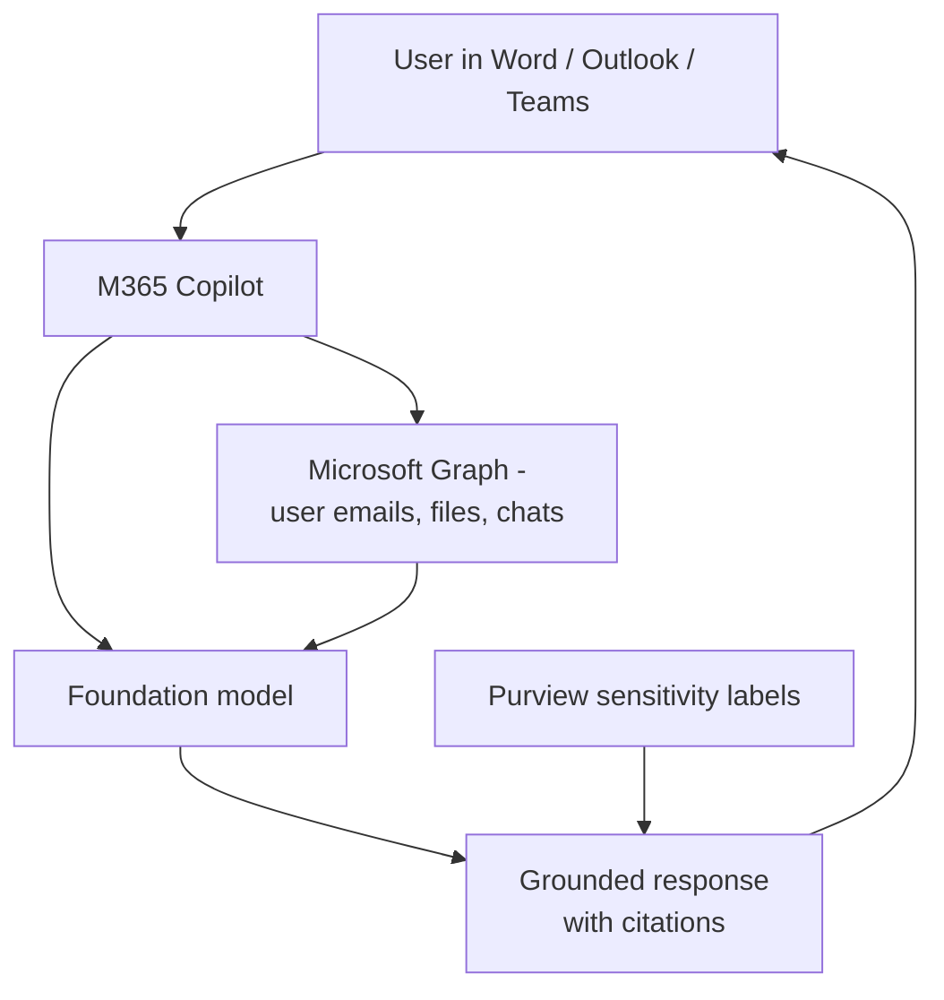
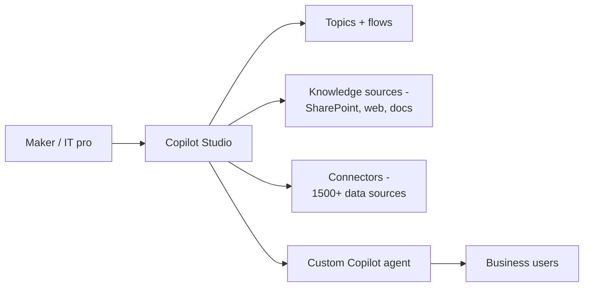
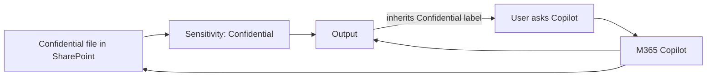
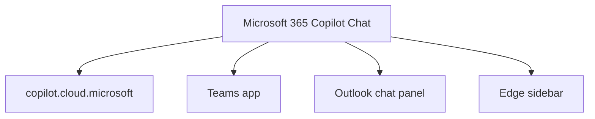

# AB-730 Architectures

> Conceptual architectures relevant to a business user.

## 1. Microsoft Copilot (free, web)

## 2. Microsoft 365 Copilot (tenant-grounded)

## 3. Copilot Studio (custom agent)

## 4. Sensitivity label flow

## 5. M365 Copilot Chat surfaces

---

[Master Index](00-MASTER-INDEX.md)
